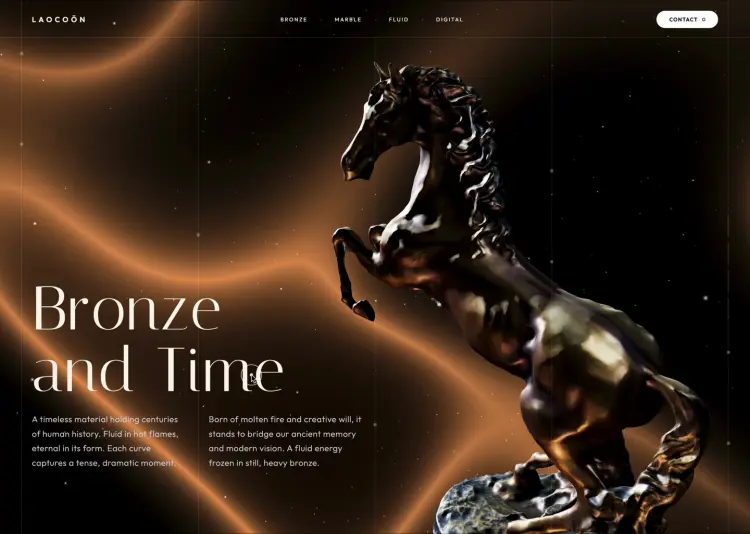

  

# Laocoön

**Bronze and Time**

A cinematic scroll experience built around a 3D bronze horse sculpture. As you scroll through 900 vh of darkness, the camera orbits a full 360° while forge sparks drift upward and a liquid-bronze wave shader shifts from molten gold to deep sapphire. Four editorial text slides fade in letter by letter with a blur-up effect. Dark, slow, and intentionally heavy.

---

### What's inside

- **WebGL scene** — Three.js with a real `.glb` bronze sculpture lit by dramatic spotlights
- **GLSL shader** — custom liquid-wave background that morphs from bronze to blue as you scroll
- **450 forge sparks** — additive particles that react to scroll velocity
- **360° camera orbit** — the camera circles the sculpture across the full page height
- **Per-letter animation** — each character blurs up independently with staggered timing
- **Scroll-linked progress** — vertical dash bars fill to show which chapter you're in
- **Grid with drifting dots** — subtle dot elements move along vertical grid lines
- **Double-ring cursor** — inner ring snaps, outer ring follows with lerp

### Stack

Single HTML file. Three.js r0.160 via importmap, GLSL fragment shader, vanilla JS scroll math.

---

Concept case — no real company, no personal data.

